# Design-Vorschläge (Godot 4)

Drei visuelle Richtungen für **Transformierende Rettungsmechs**. Alle sind mit **Godot 4** (2D, TileMap, Sprites, leichte Shader) umsetzbar — ohne 3D-Pipeline.

**Gewählt: Stil C — Comic-Rettung** (verbindlich). Style-Bible: [`STYLE-BIBLE-C.md`](STYLE-BIBLE-C.md). Art-Subagent: `.cursor/agents/comic-rettung-art.md`.

Moodboard-Bilder: [`design-refs/`](design-refs/) (Umgebung, Basis, Mech-Form, Fahrzeug-Form je Stil).

| # | Kurzname | Gefühl | Status |
|---|----------|--------|--------|
| A | Spielzeug-Iso | Plastik-Figuren, warm, greifbar | Verworfen |
| B | Bilderbuch-Seuzach | Weich, einladend, „Vorlesen“ | Verworfen |
| C | Comic-Rettung | Knallig, TV-tauglich, klare Konturen | **Gewählt** |

---

## Vorschlag A — „Spielzeug-Iso“

### Pitch
Die Welt wirkt wie ein großer Spieltisch: Mechs und Häuser sind **chunky**, abgerundet, wie lackiertes Plastik. Seuzach ist erkennbar (Kirche, Bahnhof), aber vereinfacht wie ein Modelldorf.

### Moodboard

| Umgebung | Basis |
|----------|-------|
| 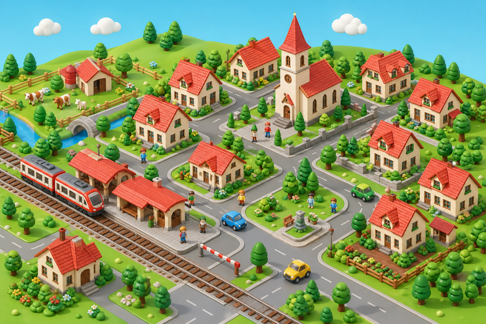 | 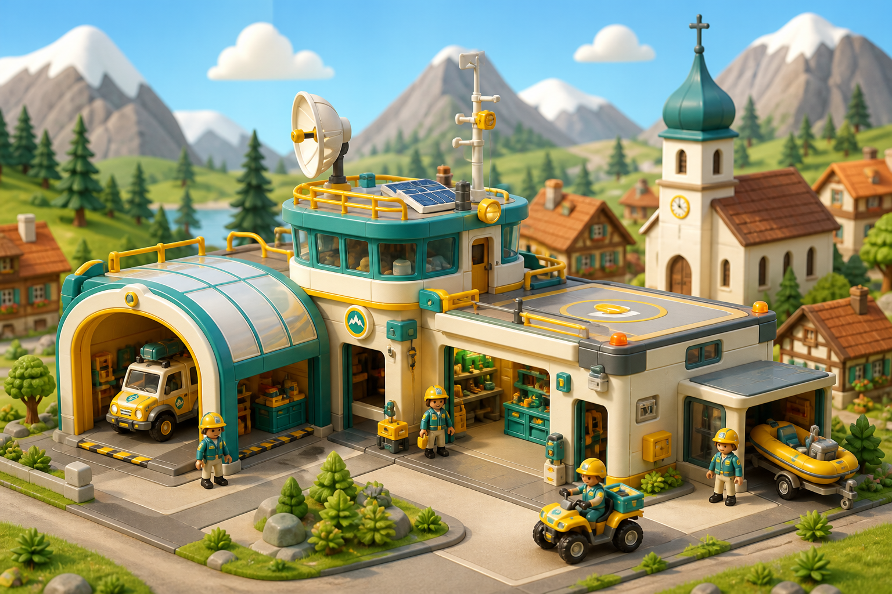 |

| Mech-Form | Fahrzeug-Form |
|-----------|---------------|
| 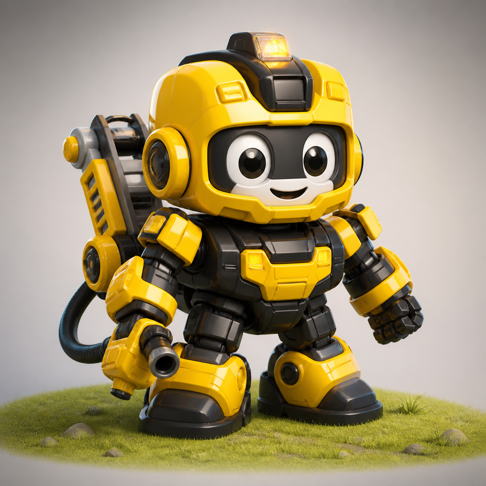 | 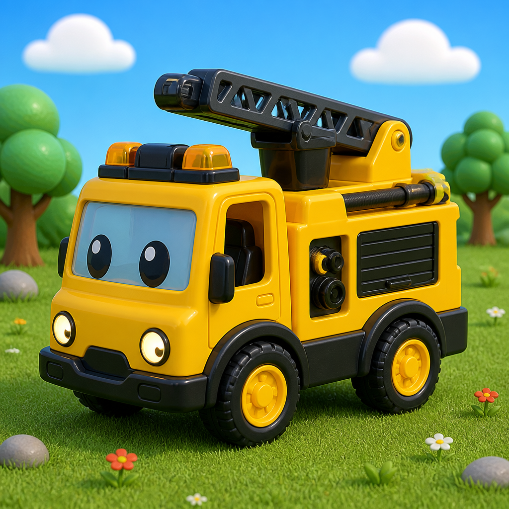 |

### Mood & Referenzen (Stil, nicht Lizenz)
Playmobil-ähnliche Proportionen, freundliche Rescue-Bot-Spielzeugoptik, moderne Indie-Iso-Spiele mit weichen Formen — **ohne** dunklen Sci-Fi-Look.

### Farbwelt

| Rolle | Hex | Nutzung |
|-------|-----|---------|
| Himmel | `#7EC8E3` | Himmel, Wasser-Highlights |
| Wiese | `#6BBF59` | Rasen, Felder |
| Straße | `#A8A29E` | Asphalt-Kacheln |
| Hausfassade | `#F5F0E8` | Gebäudekörper |
| Dach / Akzent | `#E85D4C` | Dächer, Alarm-Icons |
| Bolt | `#F5C518` + `#2B2B2B` | Gelb/Schwarz Feuerwehr |
| Marina | `#2A9D8F` + `#FFFFFF` | Türkis Wasserrettung |
| UI-Panel | `#FFF8F0` | Menüs, mit weichem Schatten |

### Charaktere & Fahrzeuge
- Große Köpfe, kurze Gliedmaßen, **große Räder/Augen**
- Transformation: Klapp-/Steck-Animation (sichtbare „Gelenke“), 6–10 Frames
- Scan-Fahrzeuge: gleiche Toy-Sprache, damit Scans zum Set passen

### Umgebung Seuzach
- Kirche, Bahnhof, Felder als **Block-Landmarken** (1–3 Kacheln hoch)
- Wenig Detailrauschen; Schatten als weiche Ellipsen unter Objekten

### UI
- Abgerundete Buttons, große Icons, Münze als Plastik-Chip
- Keine Haarlinien; mind. 4 px visuelle „Dicke“ bei 1080p

### Godot-Umsetzung

| Element | Ansatz |
|---------|--------|
| Auflösung | Basis 1920×1080; Pixel-Art **nicht** nötig — handgezeichnete/PNG-Sprites |
| Iso-Tiles | TileMap isometrisch, Kachelz. B. **128×64** (Grundfläche) |
| Figuren | `AnimatedSprite2D` / SpriteFrames; Y-Sort auf TileMap |
| Schatten | Einfacher Sprite unter der Figur oder `Modulate` |
| Shader | Optional: leichter Specular-Glanz auf Mechs (`CanvasItem` Shader, 10–20 Zeilen) |
| Spezialmissionen | Gleiche Toy-Palette; andere Kamera, gleiche Asset-Sprache |

**Passt wenn:** Ihr einen „sofort greifbaren“, verspielten Look wollt und Assets relativ schnell blockig produzieren könnt.

---

## Vorschlag B — „Bilderbuch-Seuzach“

### Pitch
Wie ein modernes Bilderbuch: weiche Kanten, dezente Texturen, viel Licht und Luft. Seuzach fühlt sich **heimisch und real** an, die Mechs bleiben freundlich-fantastisch.

### Moodboard

| Umgebung | Basis |
|----------|-------|
| 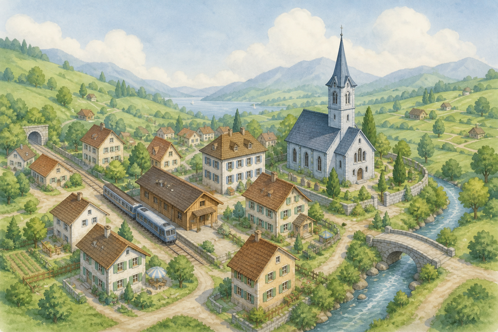 | 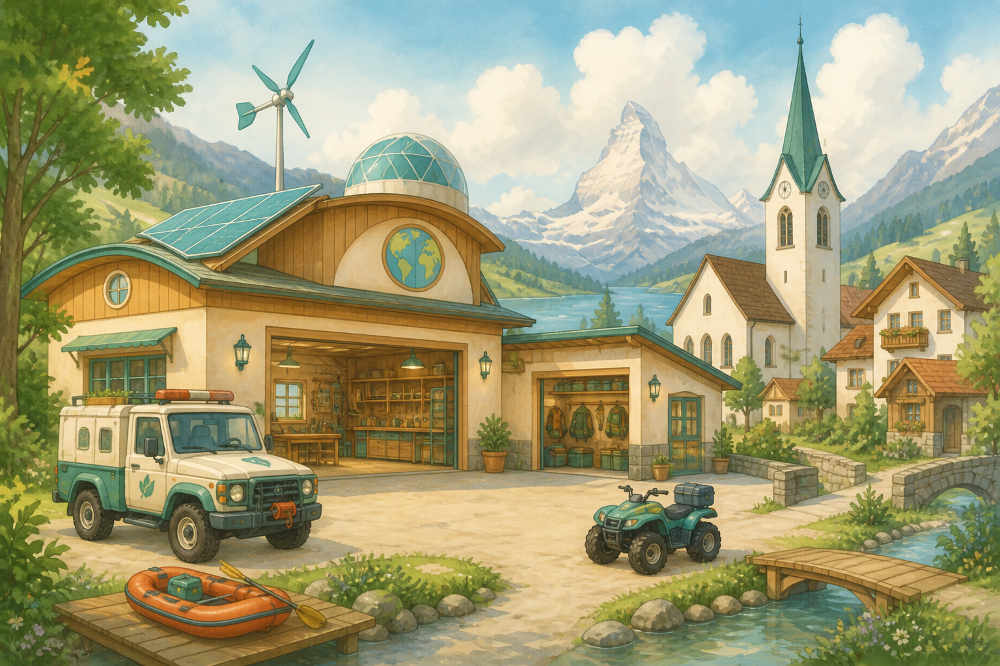 |

| Mech-Form | Fahrzeug-Form |
|-----------|---------------|
| 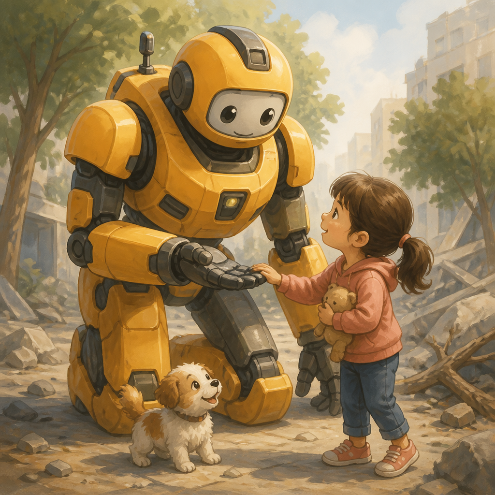 | 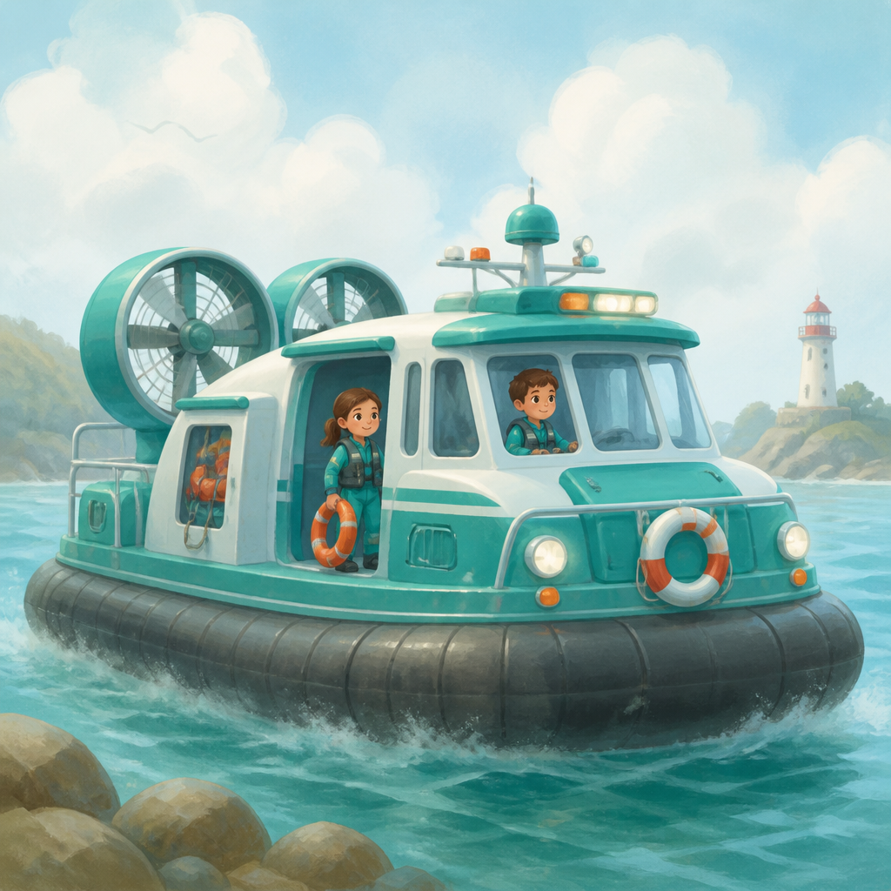 |

### Mood & Referenzen (Stil, nicht Lizenz)
Europäische Bilderbücher, weiche Indie-Adventures, Postkarten-Farben (Himmel, Wiese, Holz) — **kein** dunkles Neon, kein Heavy-Metal-Mech.

### Farbwelt

| Rolle | Hex | Nutzung |
|-------|-----|---------|
| Himmel | `#B8D4E8` | Weicher Tageshimmel |
| Laub / Feld | `#8FBC8F` / `#C4B56A` | Vegetation, Felder |
| Fassade | `#EDE6DC` | Häuser, Putz |
| Holz / Bahn | `#8B6914` | Bahnhof, Scheunen |
| Kirche | `#DCE3EA` + Kupfer `#B87333` | Landmarke |
| Bolt | `#E8A317` (gedämpftes Gelb) | Weniger „Plastik“ |
| Marina | `#3D8B8B` | Ruhiges Wasser-Türkis |
| Notfall-Glow | `#FF8A65` | Weiches Warn-Orange (kein Blutrot) |
| UI | `#F7F3EC` mit `#3A4A3A` Text | Lesbar, ruhig |

### Charaktere & Fahrzeuge
- Weichere Silhouetten, etwas schlanker als A, aber noch kindgerecht
- Transformation: morphende Zwischenframes oder „Licht-Wisch“ + Formwechsel (weniger mechanisch als A)
- Gesichtsausdrücke klar, aber nicht karikiert-extrem

### Umgebung Seuzach
- Mehr **Wiedererkennbarkeit**: Kirchturm-Silhouette, Bahnhofsdach, Baumreihen
- Sanfte Parallax-Himmelsschichten (2–3 `Parallax2D`-Layer)

### UI
- Abgerundete Karten wie Buchseiten; Aufkleber-Album optisch zentral
- Münzen als gezeichnete Medaillen

### Godot-Umsetzung

| Element | Ansatz |
|---------|--------|
| Assets | Gemalte Sprites (Aseprite/Krita), Alphakanten weich |
| Tiles | Iso-TileSet, oft mit **Varianten** (3 Gras-Tiles) gegen Repetition |
| Textur | Optional globaler leichter Paper-Noise-Shader auf World-CanvasLayer |
| Licht | `CanvasModulate` + einfache PointLights nur in Nacht-/Stromausfall-Missionen |
| Partikel | GPUParticles2D für Sonnenstaub, Löschwasser (weich) |
| Spezialmissionen | Gleicher Look; Feuer-Mission mit warmem Overlay |

**Passt wenn:** Gefühl und „echtes Dorf“ wichtiger sind als knallige Action-Optik; etwas mehr Kunst-Zeit einplanen.

---

## Vorschlag C — „Comic-Rettung“

### Pitch
Dicker Outline, flache Cel-Farben, hohe Lesbarkeit auf dem Fernseher: wie eine freundliche Action-Cartoon-Serie. Notfälle und Transformationen wirken **dynamisch und klar**.

### Moodboard

| Umgebung | Basis |
|----------|-------|
| 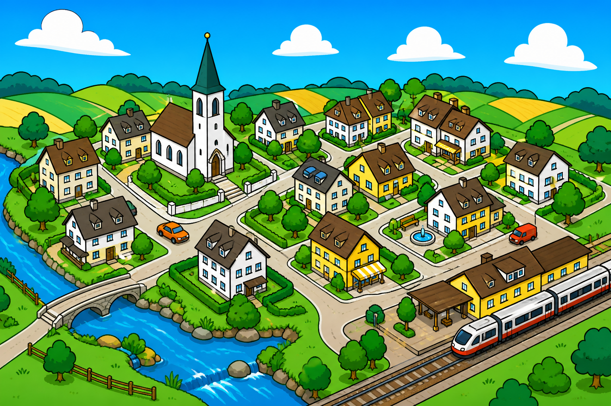 | 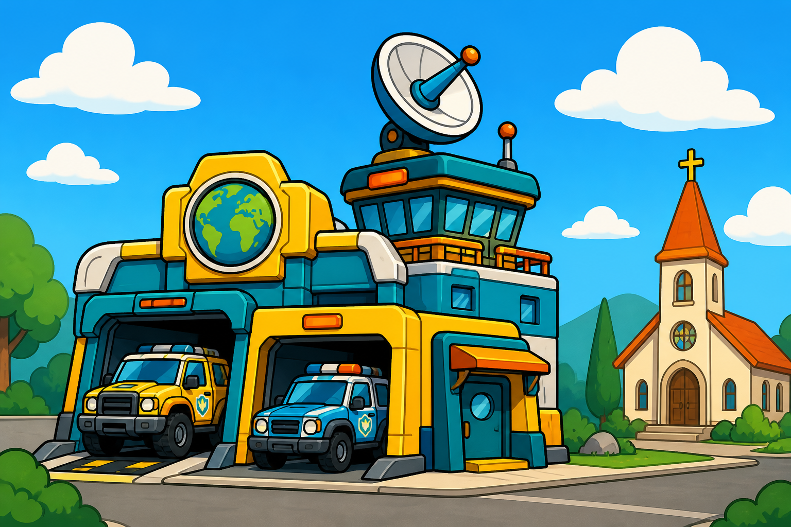 |

| Mech-Form | Fahrzeug-Form |
|-----------|---------------|
| 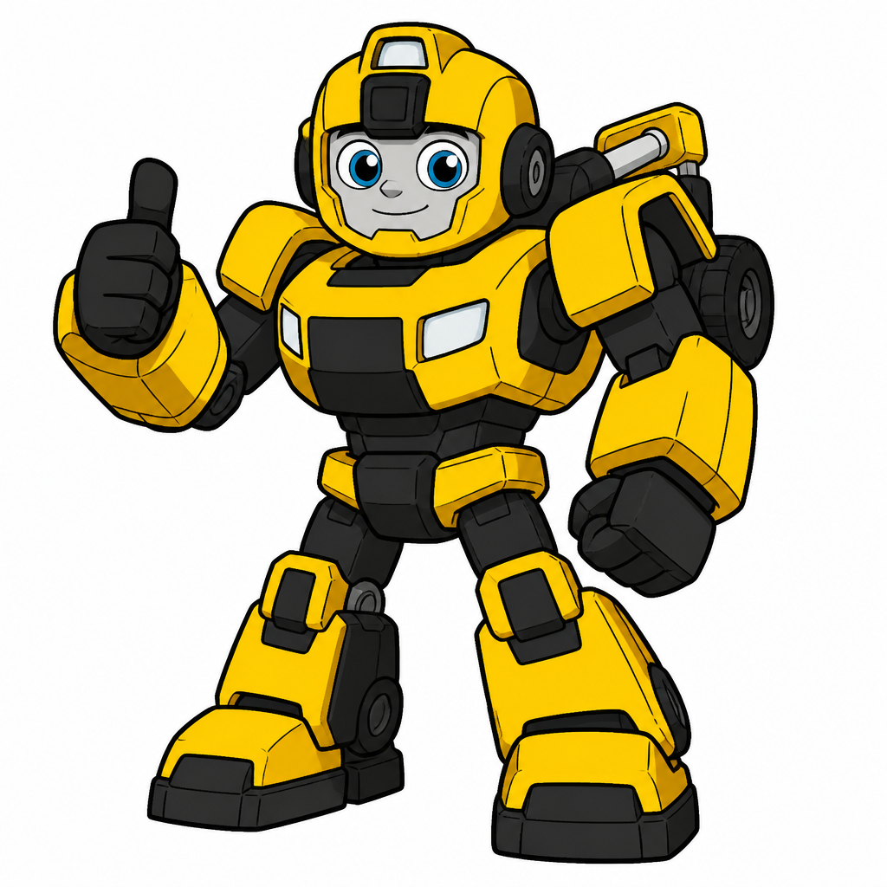 | 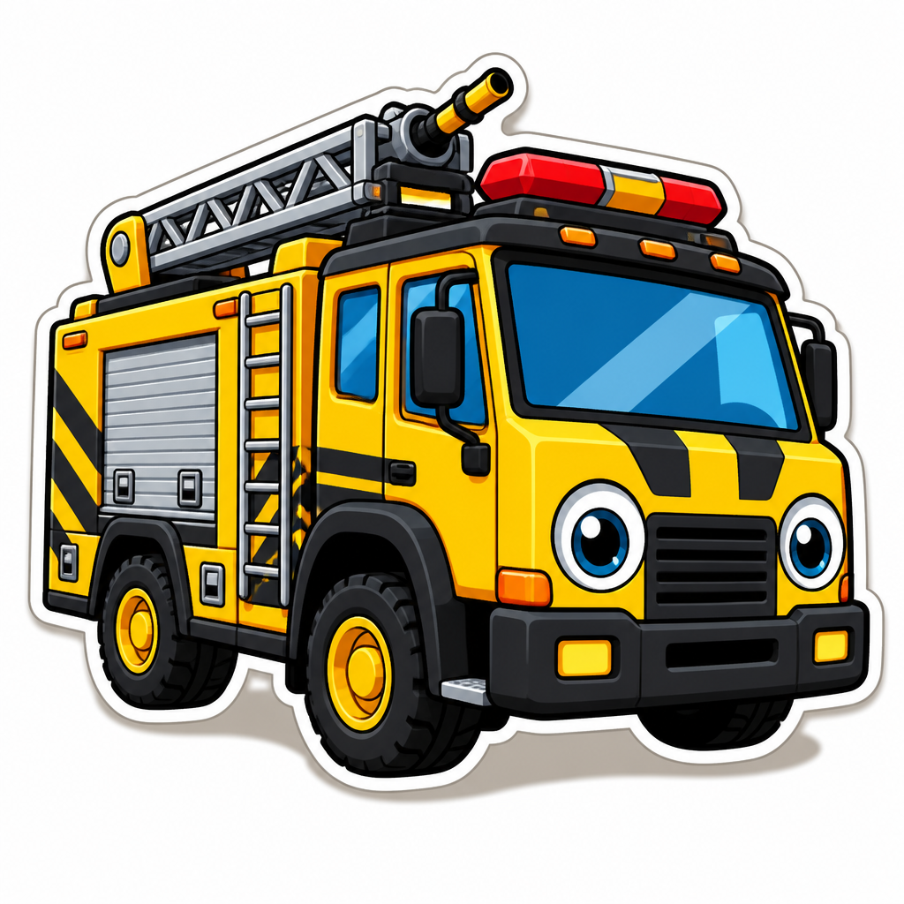 |

### Mood & Referenzen (Stil, nicht Lizenz)
Kinderserien-Cel-Shading, klare Hero-Farben, starke Silhouetten — nah an Rescue-Bots-TV-Feeling, aber eigenständig und weich genug für 6-Jährige.

### Farbwelt

| Rolle | Hex | Nutzung |
|-------|-----|---------|
| Himmel | `#4DA3FF` | Kräftig, klar |
| Gras | `#3DCC5A` | Sattgrün |
| Straße | `#6E6E6E` | Mit heller Outline-Kante |
| Gebäude | `#FFFFFF` / `#FFE082` | Flache Füllungen + Outline `#1A1A1A` |
| Alarm | `#FF5252` | Icons, Sirenen (nicht für Personen-Schaden) |
| Bolt | `#FFD600` + Schwarz | Maximal wiedererkennbar |
| Marina | `#00BFA5` + Weiß | Starke Crew-Farbe |
| Aero (später) | `#7C4DFF` sparsam | Nur Charakterfarbe, nicht ganze UI |
| UI | Weiße Panels, dicke schwarze Rahmen, Schatten versetzt (Sticker) | |

### Charaktere & Fahrzeuge
- Starke **schwarze Kontur** (2–4 px bei Zielauflösung)
- 1–2 Cel-Schattenstufen max.
- Transformation: snappy Pose-zu-Pose (weniger Soft-Morph als B)
- Team-Link: kurzer „Comic-Boom“-Impact-Frame

### Umgebung Seuzach
- Vereinfachte, aber **sofort lesbare** Icons der Landmarken
- Weniger Textur, mehr Form und Farbe
- Schilder/Icons im Level unterstützen Lesearmut

### UI
- Comic-Bubbles für Rettungs-Radio
- Große, outline-lastige Buttons; Xbox-Glyphs klar

### Godot-Umsetzung

| Element | Ansatz |
|---------|--------|
| Assets | Vektor→PNG oder Pixel-clean mit Outline **im Sprite** (zuverlässiger als Outline-Shader bei Iso) |
| Animation | Weniger Frames, stärkere Keyposes; `AnimationPlayer` für UI-Pop |
| Treffer-Feedback | Kurzes `modulate` Flash + Screen-Shake leicht (`Camera2D`) |
| Shader | Optional: nur für Energie-Waffe Glow (kurz, lokal) |
| Spezialmissionen | Side-Scroller/Flug profitieren stark von diesem klaren Look |

**Passt wenn:** Maximale Lesbarkeit, TV/Couch, Comic-Energie; Transformation und Co-op sollen „knallen“.

---

## Godot-Gemeinsamkeiten (alle drei)

Unabhängig vom gewählten Stil:

1. **Eine Style-Bibel** (Palette + Outline-Regel + Beispiel-Sprite) vor Massenproduktion  
2. **Iso-TileMap** + Y-Sort für Open World Seuzach  
3. **Spezialmissionen = eigene Scenes**, gleiche Farb-/Outline-Regeln  
4. **UI-Theme** in Godot (`Theme`-Resource) an die gewählte Richtung anbinden  
5. Controller-Glyphs und Münz-HUD im gleichen Stil zeichnen  
6. Kein Pflicht-3D, keine teuren Global-Illumination-Pipelines  

### Empfohlene erste Spike-Assets (nach Stilwahl)

- 1 Mech (Bolt) Robot + 1 Fahrzeugform  
- 8–12 Iso-Tiles (Gras, Straße, 1 Haus, Kirche-Silhouette)  
- 1 UI-Button + Münz-Icon  
- 1 Transformations-Animation (auch grob)

---

## Vergleich (Entscheidungshilfe)

| Kriterium | A Spielzeug-Iso | B Bilderbuch | C Comic-Rettung |
|-----------|-----------------|--------------|-----------------|
| Seuzach-Wiedererkennbarkeit | Mittel | Hoch | Mittel |
| Transformations-Show | Sehr gut (Klappen) | Gut (weich) | Sehr gut (snappy) |
| TV / Couch Lesbarkeit | Gut | Mittel–gut | Sehr gut |
| Kunst-Aufwand Start | Niedriger | Höher | Mittel |
| Nähe Rescue-Bots-Gefühl | Hoch (Spielzeug) | Mittel | Hoch (Serie) |
| Risiko „zu babyig“ | Mittel | Niedrig–mittel | Niedrig |
| Risiko „zu hart/action“ | Niedrig | Niedrig | Mittel (durch weiche Formen steuerbar) |

### Empfehlung (Arbeitsvorschlag)

**Umgesetzt:** Stil **C (Comic-Rettung)** ist projektweit festgelegt. Siehe [`STYLE-BIBLE-C.md`](STYLE-BIBLE-C.md) und Subagent `.cursor/agents/comic-rettung-art.md`.

---

## Nächster Schritt

Style-Bible C ist aktiv. Neue Grafiken/Animationen über den Art-Subagenten erzeugen (Referenzen: `design-refs/c-*.png`).
