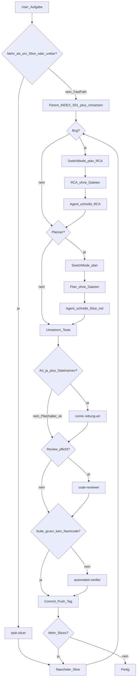

# Entwicklungsablauf (mit Subagenten)

Verbindlicher Ablauf für Features und größere Änderungen an *Transformierende Rettungsmechs*.

**Engine:** Godot 4 · **Art:** Stil C (Comic-Rettung) · **Git:** nach jedem Slice commit + push + SemVer-Tag (`git-release`)

**Test-Default:** Headless- und automatisierte Tests reichen (`./scripts/run_tests.sh`). **Physisches Spielen / Godot-GUI** nur auf **explizite User-Anforderung**.

**Preis-Leistung:** Subagenten nur wenn sie Scope oder Qualität wirklich tragen. Kleine Arbeit läuft im **Parent-Fast-Path** (eine Runde).

---

## Parent-Fast-Path (Default für kleine Arbeit)

**Kein** `task-slicer`, **kein** `feature-implementer`, **kein** `code-reviewer`, **kein** `automated-verifier`, **kein** `comic-rettung-art`, wenn **alle** gelten:

- klar **ein** Slice (oder Hotfix)
- Docs-only **oder** eine Datei / Konstanten / offensichtliche Single-System-Änderung
- Scope nicht unklar

**Wer:** Hauptagent.

**Was:** Mini-INDEX (`docs/plans/<kurzname>/INDEX.md`, eine Zeile S01) + Stub mit Feature + In + Nicht → umsetzen → automatisierte Tests (falls Code) → kurzer Selbstcheck (Akzeptanz, Suite grün ja/nein) → commit + push + SemVer-Tag.

INDEX trotzdem anlegen. Ohne INDEX keine Lieferung der Gesamtaufgabe.

---

## Phase S — Zerlegung (nur ab Größe)

**Wann:** Aufgabe braucht **zwei oder mehr** Slices **oder** der Scope ist unklar. Sonst Fast-Path: Parent legt S01 selbst an.

**Wer:** Subagent `task-slicer`.

**Was:** Feature-Schritte, keine Prozess-Phasen.

**Packing:** ein Slice = **zwei verwandte** / **zwei zusammengehörige** spieler-sichtbare Inkremente, wenn sie Systeme teilen und zusammen review-/testbar sind (~2×).

**Keine** Slices für Review, Tests, Verify, Git, RCA, „Datei speichern“ vs. „verdrahten“.

**Output:** INDEX + Stub pro Feature (`docs/plans/_SLICE_INDEX.md`, `docs/plans/_SLICE.md`). Optional Art ja/nein **mit Dateinamen** + 2-Bullet-Testplan.

### Zuschnitt (Beispiele)

- **Häuser:** zwei Häuser derselben Strasse / desselben Quartiers — nicht die ganze Siedlung
- **Karte:** zwei benachbarte Rasterzellen / ein kleines Quartier-Paar
- **Art:** zwei verwandte Landmarks, wenn der Slice beide nennt
- **Gameplay:** zwei zusammengehörige Verhaltensweisen, oder eine User-Beschwerde mit zwei engen Punkten
- **Schulen:** ein Campus (Cluster) = ein Slice
- **Prozess/Docs:** ein Thema = ein Slice

**Zu groß:** komplette Karte, alle Strassen, Housing überall, alle Schulen, ganz Seuzach/Schema-Dorf.

Slices nacheinander: Ablauf 0–4 + Git pro Slice. **Hotfix** = Fast-Path, ein Slice.

---

## Phase 0 — Repro & RCA (bei Fehlern Pflicht)

**Wann:** Bug, Verify-/Test-Fail, Crash, Regression, Review-Finding mit Fehlverhalten — **bevor** Phase 2 dieses Slices.

**Wer:** Hauptagent (Tests/Logs). Ergebnis im Slice („Repro & RCA“) oder `docs/plans/bugs/<kurzname>.md` — **erst im Agent-Modus nach Freigabe**.

### Plan-Modus zuerst (Pflicht)

1. **Sofort** in den Cursor-**Plan-Modus** wechseln (`SwitchMode` → `plan`). Repro/RCA **nicht** vorher in Dateien schreiben.
2. Im Plan-Modus: reproduzieren (read-only/tests soweit der Modus es erlaubt), Hypothesen, Ursache, Nicht-Ursache, Fix-Richtung, Risiken vorlegen. **Keine** Repo-Writes.
3. **Bei Unklarheit immer nachfragen** — nicht raten, Plan/RCA nicht still festlegen.
4. Nach User-Freigabe und **zurück im Agent-Modus:** erst dann Repro & RCA ins Slice-File oder `docs/plans/bugs/<kurzname>.md` schreiben.

Pflichtinhalt der RCA (nach dem Schreiben):

1. Reproduktion (Schritte, erwartet/tatsächlich, failender Test bevorzugt) → bestätigt oder nicht reproduzierbar (kein Blind-Fix)
2. Ursache, Nicht-Ursache, Fix-Richtung, Risiken

**Verboten:** Verdachts-Fixes ohne Repro (außer Hotfix + RCA-Nachzug); unrelated Änderungen; nächsten Slice vor Pass des aktuellen; RCA-Dateien schreiben solange noch Plan-Modus.

Findings aus Phase 3/4 die Bugs sind: erneut Phase 0 (wieder Plan-Modus zuerst), dann Fix, dann Review/Verify dieses Slices wiederholen.

---

## Phase 1 — Plan (oft überspringen)

**Wer:** Hauptagent oder `feature-planner`  
**Input:** genau ein Slice aus dem INDEX.  
**Output:** dasselbe Slice-File, ausgebaut nach `_TEMPLATE.md` — **erst im Agent-Modus nach Plan-Freigabe**.

**Skip:** Stub hat Feature + In + Nicht **und** Änderung offensichtlich. Implementer/Parent ergänzt Testplan/Akzeptanz in derselben Datei. Kein Plan-Modus nötig.

**Planner behalten:** Bugs (RCA), Art mit echten Dateien, Multi-System, unklarer Scope.

### Plan-Modus zuerst (Pflicht, wenn Planner läuft)

1. **Sofort** in den Cursor-**Plan-Modus** wechseln (`SwitchMode` → `plan`). Nicht vorher Slice-Dateien vollschreiben.
2. Im Plan-Modus: recherchieren, Plan vorlegen (Ziel, Scope, Schritte, Tests, Art-Dateinamen, Gates). **Keine** Repo-Writes.
3. **Bei Unklarheit immer nachfragen**. Nicht raten, nicht still festlegen.
4. Nach User-Freigabe und **zurück im Agent-Modus:** erst dann `S<nn>-<slug>.md` nach `_TEMPLATE.md` schreiben.

**Verboten:** Annahmen als beschlossene Sache ohne Frage. Innerhalb einer Umsetzung neu auftauchende Unklarheit → wieder Plan-Modus + Frage.

Ohne Feature+In+Nicht keine Implementierung (außer Hotfix). Bei Bugs ohne Phase 0 keine Phase 2. Planner darf Slices nicht neu schneiden.

Voller Plan-Inhalt: Ziel, Scope, Systeme, Schritte, Testplan (automatisiert Pflicht), Art-Bedarf mit **konkreten Dateinamen** oder „keine“, Akzeptanz, bei Bugs Repro & RCA.

Art-Hinweise (wenn Art: ja): Stil C; Referenzen `docs/design-refs/c-*.png` inkl. `c-iso-city-map.png` für Welt/Karte/Gebäude = **Haus–Strasse-Interaktion**, nicht Masse/Kamera/Größe; Proportionen aus `c-umgebung`/`c-basis`/bestehenden C-Assets.

---

## Phase 2 — Umsetzen

**Wer:** `feature-implementer` — **außer Fast-Path** (dann Parent).  
INDEX-Zeile zu Beginn `in Arbeit`.

- Nur dieses Slice-File
- Bugs: erst Regressionstest rot, dann Fix grün
- Suite **einmal** grün (`./scripts/run_tests.sh`), Handoff `suite green: yes/no`
- **Art:** `comic-rettung-art` **nur** wenn Slice `Art: ja` **und** eine Dateiliste hat. Sonst bestehende Assets / Platzhalter. Nie „mitdenken“
- Nach Art **Pflicht:** `python3 scripts/process_art_alpha.py` und `python3 scripts/verify_art_alpha.py` (Exit 0). Keine weiße/graue/schwarze KI-Platte. Verify rot = nicht übergeben. Neue PNGs ggf. `godot --headless --path . --import`
- Gebäude: nie RoadKit-Asphalt übermalen; street-aligned `_ew`/`_ns` (kein `_ns` aus `_ew` rotieren)
- Kein Scope auf Nachbarn; kein INDEX `erledigt`

---

## Phase 3 — Code Review

**Wer:** `code-reviewer`

**Pflicht** nur wenn **spielsichtbar und nicht trivial:** Gameplay, World/RoadKit, Landmark-Placement, Art-Integration, nicht-triviale Bugs.

**Skip (Parent-Selbstcheck reicht):** Docs-Wording, Konstanten, Fast-Path-Single-File ohne die Systeme oben.

Nicht mit Phase 4 zusammenlegen. Critical/High vor Git; bug-artige Findings → Phase 0.

---

## Phase 4 — Automatisierte Verifikation

**Kein Subagent**, wenn Implementer-/Parent-Handoff `suite green: yes` **und** Review keinen weiteren Code/Art verlangt hat (oder Review geskippt). Dann Pass → Git.

**`automated-verifier` nur wenn:** Handoff fehlt, Suite nicht grün, Review Nachcode verlangt, oder User Verify ausdrücklich will.

Keine doppelte Suite, wenn schon grün gemeldet. Docs-only: Read-through, kein Game-Launch.

Phase 4b (Godot-GUI / manuelles Spielen) **nur** auf User-Anforderung — sonst kein Blocker.

Pass (oder User-Override) → Git → INDEX `erledigt` → nächster Slice.

**INDEX-Status nur:** `offen` → `in Arbeit` → `erledigt`. Kein Phasen-Churn im Slice-File.

---

## Git

Nach Pass jedes Slices: **commit + push** auf den Tracking-Branch, dann **annotiertes SemVer-Tag** und Tag pushen (siehe `.cursor/rules/git-release.mdc`).

---

## Subagenten

| Name | Wann starten |
|------|----------------|
| `task-slicer` | ≥2 Slices oder unklarer Scope — nicht Fast-Path |
| `feature-planner` | Bugs / Art-Dateien / Multi-System / unklar; zuerst Plan-Modus, Dateien erst im Agent-Modus |
| `feature-implementer` | Nicht Fast-Path; ein Slice inkl. Tests |
| `comic-rettung-art` | Nur `Art: ja` + Dateinamen im Slice; danach Alpha-Verify grün |
| `code-reviewer` | Spielsichtbar und nicht trivial |
| `automated-verifier` | Suite nicht grün / kein Handoff / Nachcode nach Review / User will Verify |

Orchestration: Hauptagent. Fast-Path oder Slicer, dann pro Slice 0 (Plan-Modus, dann RCA schreiben) → (1: Plan-Modus, dann Slice-File) → 2 → (3) → (4) → Git.

---

## Hotfix

User sagt „Hotfix“ / „nur schnell fixen“ → Fast-Path, ein Slice. Repro versuchen; RCA zuerst im Plan-Modus, nach Freigabe kurz ins Slice/Commit. Fehlt Repro: kennzeichnen, RCA nachziehen. Review/Verifier nur nach den Skip-Regeln oben (nicht pauschal Pflicht).

---

## Vorlagen

- `docs/plans/_SLICE_INDEX.md` · `docs/plans/_SLICE.md` · `docs/plans/_TEMPLATE.md`
- Spielkonzept: `docs/KONZEPT.md`
- Style: `docs/STYLE-BIBLE-C.md`
