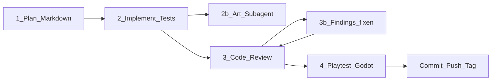

# Entwicklungsablauf (mit Subagenten)

Verbindlicher Ablauf für Features und größere Änderungen an *Transformierende Rettungsmechs*.

**Engine:** Godot 4 · **Art:** Stil C (Comic-Rettung) · **Git:** nach Abschluss commit + push + SemVer-Tag

---

## Phase 1 — Plan (Markdown)

**Wer:** Hauptagent oder Subagent `feature-planner`  
**Output:** `docs/plans/<kurzname>.md` (neu oder Update)

Der Plan enthält mindestens:

1. Ziel / User-Nutzen (1–3 Sätze)
2. Scope / Nicht-Scope
3. Betroffene Systeme (World, Mission, Save, UI, Art, …)
4. Technische Schritte (Godot-Scenes/Scripts)
5. Testplan (Unit/Integration + manuelle Playtest-Checks)
6. Art-Bedarf (ja/nein; welche Assets; Verweis Style-Bible C)
7. Akzeptanzkriterien (checkbox-fähig)

Ohne freigegebenen bzw. geschriebenen Plan-File **keine** Implementierung starten (außer der User verlangt explizit einen Hotfix).

---

## Phase 2 — Umsetzen (Subagent)

**Wer:** Subagent `feature-implementer`  
**Pflicht:**

- Umsetzung laut Plan-File
- **Automatisierte Tests** mitliefern (Godot-Test-Framework des Repos, z. B. GdUnit4/GUT sobald eingerichtet; bis dahin `*.gd`-Tests / CI-fähige Runner-Scripts)
- Bei Grafiken oder Animationen **immer** Subagent `comic-rettung-art` hinzuziehen (Referenzen `docs/design-refs/c-*.png`, Style-Bible C)
- Keine Stil-A/B-Assets
- Am Ende: kurze Handoff-Liste (geänderte Dateien, wie Tests starten)

Der Implementer merged Art-Ergebnisse ins Godot-Projekt (`assets/…`, SpriteFrames, etc.).

---

## Phase 3 — Code Review (Subagent)

**Wer:** Subagent `code-reviewer` (read-focused Review, Findings als Liste)

Prüft u. a.:

- Plan-Abdeckung und Akzeptanzkriterien
- Tests vorhanden und sinnvoll
- Godot-Konventionen, keine Secrets
- Kindgerecht / Konzept-Konformität (kein Online, keine Gewalt gegen Personen)
- Art nur Stil C, wenn Assets neu

**Findings beheben:** Hauptagent oder `feature-implementer` fixt alle **Critical/High** (und Medium wenn schnell). Danach **erneuter Review**, bis keine offenen Critical/High mehr.

---

## Phase 4 — Playtest (Subagent)

**Wer:** Subagent `godot-playtester`

- Godot-Projekt starten (Editor-frei: `godot4`/`godot` mit `--path`)
- Automatisierte Tests ausführen
- Spiel kurz laufen lassen (Smoke: Haupt-Scene lädt, keine Fatal Errors)
- Bei GUI/Display-Problemen: Headless-Tests + Log-Analyse; Blocker klar melden
- Ergebnis: Pass/Fail + Log-Auszüge + was manuell noch offen ist

Nur bei **Pass** (oder explizitem User-Override) gilt die Aufgabe als fertig → Git-Release.

---

## Subagenten-Übersicht

| Name | Datei | Rolle |
|------|-------|--------|
| `feature-planner` | `.cursor/agents/feature-planner.md` | Plan nach `docs/plans/` |
| `feature-implementer` | `.cursor/agents/feature-implementer.md` | Code + automatisierte Tests; ruft Art |
| `comic-rettung-art` | `.cursor/agents/comic-rettung-art.md` | Grafik & Animation Stil C |
| `code-reviewer` | `.cursor/agents/code-reviewer.md` | Review + Findings |
| `godot-playtester` | `.cursor/agents/godot-playtester.md` | Tests + Spielstart |

Orchestration liegt beim **Hauptagenten**: Phasen der Reihe nach anstoßen, Findings-Loop in Phase 3, Release erst nach Phase 4.

---

## Ausnahme: Hotfix

Nur wenn der User klar „Hotfix“ / „nur schnell fixen“ sagt: Phase 1 darf ein Mini-Plan (kurze Abschnitte) sein; Phase 3+4 bleiben Pflicht.

---

## Vorlagen

Plan-Vorlage: Abschnitt „Plan-Template“ in diesem Dokument oder Kopie von `docs/plans/_TEMPLATE.md`.
