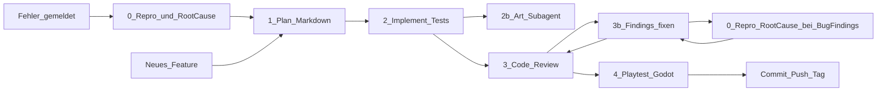

# Entwicklungsablauf (mit Subagenten)

Verbindlicher Ablauf für Features und größere Änderungen an *Transformierende Rettungsmechs*.

**Engine:** Godot 4 · **Art:** Stil C (Comic-Rettung) · **Git:** nach Abschluss commit + push + SemVer-Tag

---

## Phase 0 — Reproduktion & Root-Cause (bei Fehlern Pflicht)

**Wann:** Jeder Bug, Playtest-Fail, Test-Fail, Crash, Regression oder Review-Finding, das ein **Fehlverhalten** beschreibt — **bevor** eine Fix-Umsetzung (Phase 2) beginnt.

**Wer:** Hauptagent und/oder `godot-playtester` (Repro) + Analyse; Ergebnis steht im Plan oder in `docs/plans/bugs/<kurzname>.md`.

### Pflichtschritte (Reihenfolge)

1. **Reproduzieren**
   - Konkrete Schritte, Build/Branch, Input-Gerät, Scene
   - Tatsächliches vs. erwartetes Verhalten
   - Logs, Stacktraces, Screenshots wo sinnvoll
   - Ergebnis: **Repro bestätigt** (oder **nicht reproduzierbar** — dann kein Blind-Fix; stattdessen mehr Instrumentierung/Fragen)
2. **Root-Cause-Analyse (RCA)**
   - Hypothesen → gezielt widerlegen/bestätigen
   - Ursache benennen (Datei/System/Annahme), nicht nur Symptome
   - Abgrenzung: Was ist *nicht* die Ursache
   - Vorgeschlagene Fix-Richtung + Risiko von Nebenwirkungen
3. **Dokumentieren** im Plan (Abschnitt „Repro & RCA“) oder Bug-File
4. **Erst danach** Phase 1 (Fix-Plan) bzw. Phase 2

### Verboten

- Fixes „auf Verdacht“ ohne bestätigte Repro (außer User-Override als Hotfix *und* RCA-Nachzug im gleichen PR/Commit-Zyklus)
- Mehrere unrelated Änderungen unter dem Dec eines ungeklärten Bugs

### Review-/Playtest-Findings

Wenn Phase 3 oder 4 einen **Bug** meldet: vor dem Fix erneut **Phase 0** (Repro + RCA), dann fixen, dann Review/Playtest wiederholen.

---

## Phase 1 — Plan (Markdown)

**Wer:** Hauptagent oder Subagent `feature-planner`  
**Output:** `docs/plans/<kurzname>.md` (neu oder Update)

Der Plan enthält mindestens:

1. Ziel / User-Nutzen (1–3 Sätze)
2. Scope / Nicht-Scope
3. Betroffene Systeme (World, Mission, Save, UI, Art, …)
4. Technische Schritte (Godot-Scenes/Scripts)
5. Testplan (Unit/Integration + manuelle Playtest-Checks) — bei Bugs: **Regressionstest für die Repro**
6. Art-Bedarf (ja/nein; welche Assets; Verweis Style-Bible C)
7. Akzeptanzkriterien (checkbox-fähig)
8. Bei Fehlern: Abschnitt **Repro & RCA** (Phase 0 erfüllt, Checkboxen)

Ohne freigegebenen bzw. geschriebenen Plan-File **keine** Implementierung starten (außer dokumentierter Hotfix). Bei Bugs: ohne Phase 0 **keine** Phase 2.

---

## Phase 2 — Umsetzen (Subagent)

**Wer:** Subagent `feature-implementer`  
**Pflicht:**

- Umsetzung laut Plan-File
- Bei Bugs: Fix erst starten, wenn Plan „Repro bestätigt“ + RCA ausgefüllt ist; zuerst **Regressionstest**, der die Repro rot macht, dann Fix bis grün
- **Automatisierte Tests** mitliefern (Godot-Test-Framework des Repos, z. B. GdUnit4/GUT sobald eingerichtet; bis dahin `*.gd`-Tests / CI-fähige Runner-Scripts)
- Bei Grafiken oder Animationen **immer** Subagent `comic-rettung-art` hinzuziehen (Referenzen `docs/design-refs/c-*.png`, Style-Bible C)
- Art unter `assets/art/`: `process_art_alpha.py` + `verify_art_alpha.py` (Pflicht, keine weißen Sprite-Platten)
- Keine Stil-A/B-Assets
- Am Ende: kurze Handoff-Liste (geänderte Dateien, wie Tests starten)

Der Implementer merged Art-Ergebnisse ins Godot-Projekt (`assets/…`, SpriteFrames, etc.).

---

## Phase 3 — Code Review (Subagent)

**Wer:** Subagent `code-reviewer` (read-focused Review, Findings als Liste)

Prüft u. a.:

- Plan-Abdeckung und Akzeptanzkriterien
- Bei Bugfixes: Repro/RCA dokumentiert; Regressionstest vorhanden
- Tests vorhanden und sinnvoll
- Godot-Konventionen, keine Secrets
- Kindgerecht / Konzept-Konformität (kein Online, keine Gewalt gegen Personen)
- Art nur Stil C, wenn Assets neu

**Findings beheben:** Bug-artige Findings → **Phase 0**, dann Fix durch Hauptagent/`feature-implementer`. Danach **erneuter Review**, bis keine offenen Critical/High mehr.

---

## Phase 4 — Playtest (Subagent)

**Wer:** Subagent `godot-playtester`

- Godot-Projekt starten (Editor-frei: `godot4`/`godot` mit `--path`)
- **Art:** `python3 scripts/verify_art_alpha.py` muss grün sein (keine weißen Hintergründe)
- Automatisierte Tests ausführen
- Spiel kurz laufen lassen (Smoke: Haupt-Scene lädt, keine Fatal Errors)
- Bei GUI/Display-Problemen: Headless-Tests + Log-Analyse; Blocker klar melden
- Bei Fail: Repro-Schritte für Phase 0 liefern (nicht nur „kaputt“)
- Ergebnis: Pass/Fail + Log-Auszüge + was manuell noch offen ist

Nur bei **Pass** (oder explizitem User-Override) gilt die Aufgabe als fertig → Git-Release.

---

## Subagenten-Übersicht

| Name | Datei | Rolle |
|------|-------|--------|
| `feature-planner` | `.cursor/agents/feature-planner.md` | Plan nach `docs/plans/` inkl. Repro/RCA-Abschnitt bei Bugs |
| `feature-implementer` | `.cursor/agents/feature-implementer.md` | Code + automatisierte Tests; ruft Art; Bugfix erst nach Phase 0 |
| `comic-rettung-art` | `.cursor/agents/comic-rettung-art.md` | Grafik & Animation Stil C |
| `code-reviewer` | `.cursor/agents/code-reviewer.md` | Review + Findings; prüft RCA bei Bugfixes |
| `godot-playtester` | `.cursor/agents/godot-playtester.md` | Tests + Spielstart; liefert Repro bei Fail |

Orchestration liegt beim **Hauptagenten**: Phase 0 bei Fehlern, dann 1→2→3→4; Findings-Loop mit erneuter Phase 0.

---

## Ausnahme: Hotfix

Nur wenn der User klar „Hotfix“ / „nur schnell fixen“ sagt:

- Mini-Plan erlaubt
- **Repro trotzdem versuchen**; RCA darf kurz sein, muss aber im Plan/Commit-Beschreibung stehen
- Fehlt die Repro: im Plan als „Hotfix ohne stabile Repro“ kennzeichnen und Follow-up-RCA nachziehen
- Phase 3+4 bleiben Pflicht

---

## Vorlagen

- Feature/Bug-Plan: `docs/plans/_TEMPLATE.md`
- MVP: `docs/plans/mvp.md`
