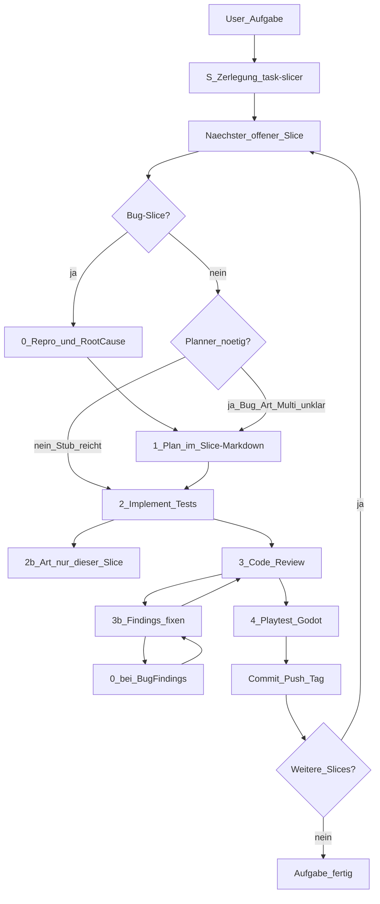

# Entwicklungsablauf (mit Subagenten)

Verbindlicher Ablauf für Features und größere Änderungen an *Transformierende Rettungsmechs*.

**Engine:** Godot 4 · **Art:** Stil C (Comic-Rettung) · **Git:** nach **jedem Slice** commit + push + SemVer-Tag

Ziel des Loops: **ca. 2× so viel** zusammengehörige, spieler-sichtbare Arbeit **pro Slice**, und **keine Doppelarbeit** (Planner-Skip, kein Suite-Replay, INDEX-Status nur drei Werte) — ohne merkbaren Qualitätsverlust. Code-Review und Playtest bleiben **getrennte** Pflicht für spielsichtbare Arbeit.

---

## Phase S — Zerlegung in Feature-Schritte (immer zuerst)

**Wann:** **Jede** neue Aufgabe — **bevor** geplant oder gebaut wird.

**Wer:** Subagent `task-slicer`.

**Was:** Das User-Feature in **Feature-Schritte** schneiden. **Nicht** in Prozess-Phasen schneiden.

**Packing (Default):** ein Slice = **zwei verwandte** / **zwei zusammengehörige** spieler-sichtbare Inkremente, wenn sie Systeme teilen und **zusammen** review- und playtestbar sind (~2× so viel Arbeit wie ein einzelnes Haus/eine einzelne Zelle). Weniger Plan→Review→Playtest→Git-Schleifen, gleiche Gates.

**Keine** Slices für Review, Tests, Playtest, Git, RCA, „Datei speichern“ vs. „Docs verdrahten“. Das steckt schon in Phase 0–4 + Git **pro Feature-Schritt**.

**Output:** kurzes INDEX + ein **kurzer Stub** pro Feature (`docs/plans/_SLICE_INDEX.md`, `docs/plans/_SLICE.md`). Stub: Feature + In + Nicht; optional Art ja/nein und 2-Bullet-Testplan (damit Phase 1 übersprungen werden kann). Den vollen Plan (RCA, lange Technische Schritte) schreibt Phase 1 **nur wenn nötig**.

### Zuschnitt (Beispiele)

- **Häuser:** zwei Häuser derselben Strasse / desselben Quartiers — nicht die ganze Siedlung.
- **Karte:** zwei benachbarte Rasterzellen / ein kleines Quartier-Paar.
- **Art:** zwei verwandte Landmarks (z. B. zwei Kigas desselben Typs), wenn der Slice beide nennt.
- **Gameplay:** zwei zusammengehörige Verhaltensweisen, oder **eine** User-Beschwerde die zwei enge Punkte ist (z. B. Spawn + sichtbare Strassen).
- **Prozess/Docs:** ein Thema = **ein** Slice (Bild+Bible+Regel zusammen, nicht „Datei speichern“ dann „verdrahten“).
- **Schulen:** ein Campus (bereits 3-Gebäude-Cluster) bleibt **ein** Slice — schon gepackt.
- **Ohringen:** eigene Zellen; ein Slice darf **zwei** verwandte Ohringen-Zellen umfassen.

**Zu groß:** komplette Karte, alle Strassen, Housing überall, alle Schulen, ganz Seuzach.

Ohne INDEX **keine** Phase 1–4 für die Gesamtaufgabe. Slices **nacheinander**: für jeden den Ablauf 0–4 + Git.

Ausnahme: **Hotfix** — INDEX mit einem Slice.

---

## Phase 0 — Reproduktion & Root-Cause (bei Fehlern Pflicht)

**Wann:** Jeder Bug, Playtest-Fail, Test-Fail, Crash, Regression oder Review-Finding, das ein **Fehlverhalten** beschreibt — **bevor** eine Fix-Umsetzung (Phase 2) **dieses Slices** beginnt.

**Wer:** Hauptagent und/oder `godot-playtester` (Repro) + Analyse; Ergebnis steht im **Slice-Markdown** (Abschnitt „Repro & RCA“) oder in `docs/plans/bugs/<kurzname>.md`.

### Pflichtschritte (Reihenfolge)

1. **Reproduzieren**
   - Konkrete Schritte, Build/Branch, Input-Gerät, Scene
   - Tatsächliches vs. erwartetes Verhalten
   - Logs, Stacktraces, Screenshots wo sinnvoll
   - Ergebnis: **Repro bestätigt** (oder **nicht reproduzierbar** — dann kein Blind-Fix; stattdessen mehr Instrumentierung/Fragen)
2. **Root-Cause-Analyse (RCA)**
   - Hypothesen → gezielt widerlegen/bestätigen
   - Ursache benennen (Datei/System/Annahme), nicht nur Symptome
   - Abgrenzung: Was ist *nicht* die Ursache
   - Vorgeschlagene Fix-Richtung + Risiko von Nebenwirkungen
3. **Dokumentieren** im Slice-Plan (Abschnitt „Repro & RCA“)
4. **Erst danach** Phase 1 (Fix-Plan) bzw. Phase 2 **dieses Slices**

### Verboten

- Fixes „auf Verdacht“ ohne bestätigte Repro (außer User-Override als Hotfix *und* RCA-Nachzug im gleichen Slice)
- Mehrere unrelated Änderungen unter dem Dec eines ungeklärten Bugs
- Den nächsten Slice beginnen, während der aktuelle Slice Phase 3/4 nicht bestanden hat

### Review-/Playtest-Findings

Wenn Phase 3 oder 4 einen **Bug** meldet: vor dem Fix erneut **Phase 0** (Repro + RCA), dann fixen, dann Review/Playtest **dieses Slices** wiederholen.

---

## Phase 1 — Plan (Markdown des Slices) — oft überspringen

**Wer:** Hauptagent oder Subagent `feature-planner`  
**Input:** genau **ein** Slice aus dem INDEX (`docs/plans/<kurzname>/S<nn>-<slug>.md`)  
**Output:** dasselbe File, ausgebaut nach `docs/plans/_SLICE.md` / `_TEMPLATE.md`

**Skip (keine Doppelarbeit):** Phase 1 / `feature-planner` **überspringen**, wenn der Slicer-Stub bereits **Feature + In + Nicht** hat **und** die Änderung offensichtlich ist (Docs-Wording, Konstanten, Single-File). Implementer oder Parent zieht Testplan/Akzeptanz **in dieselbe Datei** nach, während er umsetzt.

**Planner behalten** bei: Bugs (RCA), art-lastigen Slices, Multi-System-Tradeoffs, unklarem Scope.

Wenn Phase 1 läuft, enthält der Plan mindestens:

1. Ziel / User-Nutzen **dieses Slices** (1–3 Sätze)
2. Scope / Nicht-Scope (**Grenzen:** was Nachbar-Slices gehören)
3. Betroffene Systeme (World, Mission, Save, UI, Art, …)
4. Technische Schritte (Godot-Scenes/Scripts)
5. Testplan (Unit/Integration + manuelle Playtest-Checks) — bei Bugs: **Regressionstest für die Repro**
6. Art-Bedarf (ja/nein; welche Assets; Verweis Style-Bible C) — nur Assets **dieses** Slices
7. Akzeptanzkriterien (checkbox-fähig)
8. Bei Fehlern: Abschnitt **Repro & RCA** (Phase 0 erfüllt, Checkboxen)

Ohne Feature+In+Nicht im Slice-File **keine** Implementierung (außer dokumentierter Hotfix). Bei Bugs: ohne Phase 0 **keine** Phase 2.

`feature-planner` darf die Zerlegung **nicht** ersetzen oder Slices zusammenlegen.

---

## Phase 2 — Umsetzen (Subagent)

**Wer:** Subagent `feature-implementer`  
**INDEX:** beim Start dieses Slices auf `in Arbeit` setzen.  
**Pflicht:**

- Umsetzung laut **Slice-File**, nicht laut gesamter User-Story
- Bei Bugs: Fix erst starten, wenn Slice „Repro bestätigt“ + RCA ausgefüllt ist; zuerst **Regressionstest**, der die Repro rot macht, dann Fix bis grün
- **Automatisierte Tests** mitliefern (Godot-Test-Framework des Repos; bis dahin `*.gd`-Tests / `./scripts/run_tests.sh`) — Suite in diesem Slice **einmal** grün fahren und im Handoff melden
- Bei Grafiken oder Animationen **immer** Subagent `comic-rettung-art` hinzuziehen (Referenzen `docs/design-refs/c-*.png` inkl. `c-iso-city-map.png` für Welt/Karte/Gebäude = **Haus–Strasse-Interaktion**, nicht Masse/Kamera/Größe; Proportionen aus `c-umgebung`/`c-basis`/bestehenden C-Assets, Style-Bible C) — **nur** die im Slice genannten Assets
- Art unter `assets/art/`: `process_art_alpha.py` + `verify_art_alpha.py` (Pflicht, keine weißen Sprite-Platten)
- Keine Stil-A/B-Assets
- Am Ende: kurze Handoff-Liste (geänderte Dateien, wie Tests starten, **Suite grün ja/nein**)
- Slice-File **nicht** durch Phasen-Status jagen (`Entwurf` / `In Umsetzung` / `Review` / `Playtest`). INDEX trägt den Status.

Der Implementer merged Art-Ergebnisse ins Godot-Projekt (`assets/…`, SpriteFrames, etc.).

---

## Phase 3 — Code Review (Subagent)

**Wer:** Subagent `code-reviewer` (read-focused Review, Findings als Liste)

Pflicht für **spielsichtbare** Arbeit — nicht mit Playtest zusammenlegen, nicht überspringen.

Prüft u. a.:

- Slice-Abdeckung und Akzeptanzkriterien; **keine** Lieferungen aus Nachbar-Slices
- Bei Bugfixes: Repro/RCA dokumentiert; Regressionstest vorhanden
- Tests vorhanden und sinnvoll
- Godot-Konventionen, keine Secrets
- Kindgerecht / Konzept-Konformität (kein Online, keine Gewalt gegen Personen)
- Art nur Stil C, wenn Assets neu

**Findings beheben:** Bug-artige Findings → **Phase 0**, dann Fix durch Hauptagent/`feature-implementer`. Danach **erneuter Review**, bis keine offenen Critical/High mehr. Nach Review-Fixes: Implementer fährt die Suite erneut grün (Handoff aktualisieren).

---

## Phase 4 — Playtest (Subagent)

**Wer:** Subagent `godot-playtester`

**Keine doppelte Suite:** Playtest **läuft nicht** erneut `./scripts/run_tests.sh` oder `verify_art_alpha.py`, wenn der Implementer in **diesem** Slice die Suite grün gemeldet hat **und** Review keine weiteren Code-/Art-Änderungen verlangt hat. Fehlt der Handoff: Suite einmal nachziehen.

**Immer (spielsichtbar):** einzigartiger Check — Godot-Smoke (`godot --path` / `--quit-after`) + slice-spezifisch visuell.

**Art-Alpha** nur wenn `assets/art/` in diesem Slice geändert wurde (und dann nur, wenn der Implementer sie nicht schon grün gemeldet hat).

**Docs-only:** kein Godot, kein Art-Alpha — nur Docs-Tests / Read-through.

- Bei GUI/Display-Problemen: Headless-Tests + Log-Analyse; Blocker klar melden
- Bei Fail: Repro-Schritte für Phase 0 liefern (nicht nur „kaputt“)
- Ergebnis: Pass/Fail + was manuell noch offen ist

Nur bei **Pass** (oder explizitem User-Override) gilt **dieser Slice** als fertig → Git-Release → INDEX-Status `erledigt` → nächster Slice.

**INDEX-Status nur:** `offen` → `in Arbeit` (Implement-Start) → `erledigt` (nach Pass + Git). Slice-File: **Erledigt** nach Pass+Git, kein Phasen-Churn.

---

## Subagenten-Übersicht

| Name | Datei | Rolle |
|------|-------|--------|
| `task-slicer` | `.cursor/agents/task-slicer.md` | Phase S: Feature-Schritte (~2 verwandte Inkremente; kein Review/Test/Git als Slice) |
| `feature-planner` | `.cursor/agents/feature-planner.md` | Slice zum Plan ausbauen **wenn nötig**; Skip bei offensichtlichem Stub |
| `feature-implementer` | `.cursor/agents/feature-implementer.md` | Code + Tests **eines** Slices; ruft Art; Suite einmal grün |
| `comic-rettung-art` | `.cursor/agents/comic-rettung-art.md` | Grafik & Animation Stil C, nur Slice-Assets |
| `code-reviewer` | `.cursor/agents/code-reviewer.md` | Review gegen das Slice-File (Pflicht spielsichtbar) |
| `godot-playtester` | `.cursor/agents/godot-playtester.md` | Einzigartiger Smoke/Visuell; keine doppelte Suite; Docs-only ohne Godot |

Orchestration liegt beim **Hauptagenten**: zuerst `task-slicer`, dann **pro Slice** Phase 0 (bei Fehlern), Phase 1 nur wenn nötig, dann 2→3→4→Git. Findings-Loop mit erneuter Phase 0 **innerhalb** des Slices.

---

## Ausnahme: Hotfix

Nur wenn der User klar „Hotfix“ / „nur schnell fixen“ sagt:

- Mini-INDEX mit **einem** Slice
- **Repro trotzdem versuchen**; RCA darf kurz sein, muss aber im Slice/Commit stehen
- Fehlt die Repro: im Slice als „Hotfix ohne stabile Repro“ kennzeichnen und Follow-up-RCA nachziehen
- Phase 3+4 bleiben Pflicht für spielsichtbare Arbeit

---

## Vorlagen

- Slice-Index: `docs/plans/_SLICE_INDEX.md`
- Ein Schritt: `docs/plans/_SLICE.md`
- Feature/Bug-Plan (Felder, die der Planner in den Slice schreibt): `docs/plans/_TEMPLATE.md`
- MVP: `docs/plans/mvp.md`
