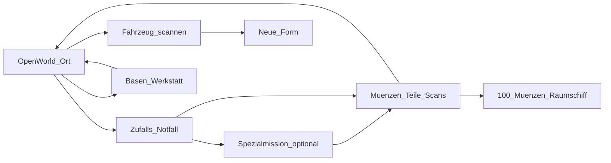
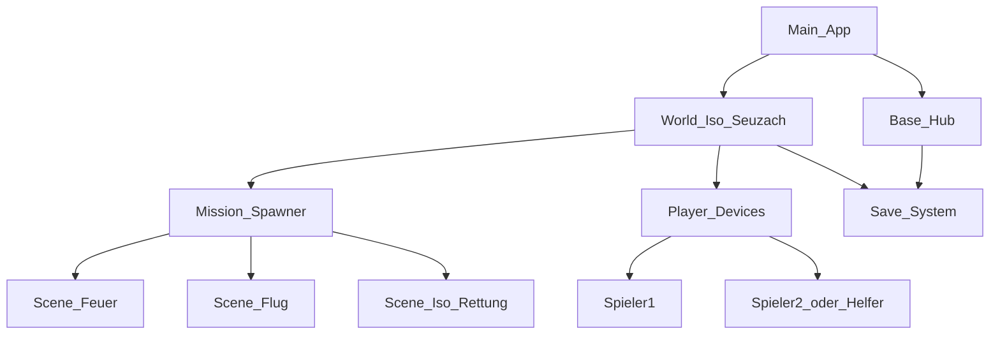

# Transformierende Rettungsmechs — Spielkonzept

**Arbeitstitel:** Transformierende Rettungsmechs  
**Repo:** [stefanObs/transforming-rescue-mechs](https://github.com/stefanObs/transforming-rescue-mechs)  
**Stand:** Konzept (kein spielbarer Prototyp)  
**Engine (festgelegt):** Godot 4 + GDScript  
**Zielgruppe:** 6–8 Jahre  
**Modi:** Solo und lokaler Multiplayer (kein Online)

---

## 1. Pitch

Rettungs-Mechs sind auf der Erde gestrandet. In echten Dörfern und Städten helfen sie bei Alltags- und ausgefallenen Notfällen, verwandeln sich in Fahrzeuge, bauen Basen aus und sammeln Münzen — bis sie ein Raumschiff finanzieren und nach Hause fliegen können.

**Ton:** warm, mutig, humorvoll, nie gruselig. Menschen und Tiere werden nicht verletzt. Konflikte nur gegen Mechs, Gebäude und Hindernisse.

**Inspiration (grob):** Transformers Rescue Bots — freundliche Transformation und Rettung, kein Kriegssetting.

**Endziel:** Über **100 Münzen** sammeln → Raumschiff freischalten → Heimflug (Kampagnen-Abschluss).

---

## 2. Zielgruppe (6–8 Jahre)

- Max. 4–5 Aktionen gleichzeitig (Bewegen, Interagieren, Transformieren, Spezial, Pause/Speichern)
- Wenig Text: Icons, Farben, kurze Sätze / Stimme
- Fail-soft: keine harte Bestrafung, Hints, Retry ohne Frust
- Drop-in für Spieler 2 jederzeit
- Starke Feedback-Schleifen: Glitzern, Jingles, Erfolgs-Banner, immer sichtbarer Münz-Zähler

---

## 3. Open World, Missionen & Speichern

### Spielstruktur

- **Open World** auf Basis echter Orte (isometrische Kachelwelt)
- **Zufällige Notfälle** erscheinen in der Welt
- Viele Notfälle führen in eine **Spezialmission** mit anderer Kamera/Steuerung
- Speichern **jederzeit** (manuell) plus **Auto-Save** an sicheren Punkten (Basis, Missionsende)

### Kernloop

1. Frei in der Welt unterwegs  
2. Zufallsnotfall annehmen  
3. Optional Spezialmission  
4. Münzen, Bauteile, Scans erhalten  
5. Basen/Werkstatt nutzen, speichern  
6. Bei 100+ Münzen: Raumschiff-Finale  

---

## 4. Perspektive & Orte

### Normalmodus: 2D-Isometrie

- Echte Dörfer und Städte als Vorbild (keine generische Fantasy-Stadt)
- Darstellung als **Kacheln** — lesbar und kindgerecht, mit wiedererkennbaren Landmarken und Straßenachsen
- Figuren und Fahrzeuge als Sprite-/Billboard-Charaktere
- Kamera folgt dem aktiven Spieler; im Co-op Soft-Zoom auf beide

### MVP-Startort: Seuzach (ZH, Schweiz)

Referenz: [Kirchgasse 6, 8472 Seuzach](https://www.google.com/maps/place/Kirchgasse+6,+8472+Seuzach/@47.5365549,8.7245484,15z)

Gemeinde bei Winterthur (~7,5 km²): Bahnhof (S11/S29), Kirche/Dorfkern, Wohnquartiere, Landwirtschaft, Wald.

**MVP-Karte (stilisiert, kachelbasiert):**

| Zone | Inhalt |
|------|--------|
| Dorfkern / Kirchgasse | Start, Erdstation in der Nähe |
| Bahnhof & Gleise | Verkehr, Zug-Notfälle |
| Wohnquartiere & Spielplätze | Alltagsnotfälle |
| Felder / Bauernhöfe | Offenes Gelände, Landmaschinen-Scans |
| Waldrand | Natur- und Wetter-Einsätze |
| Rand Richtung Winterthur | Kartengrenze / späterer Expand |

Später weitere echte Orte als Kapitel (z. B. Winterthur, Zürichsee, Berge).

---

## 5. Notfall-Spektrum

### Alltag

Feuer, Wasserrohrbruch, Verkehrschaos, vermisste Katze, umgestürzter Baum, freundliche medizinische Hilfe (ohne gore).

### Ausgefallen

- Abgestürzte **freundliche Aliens** helfen (Schiff bergen, Übersetzer, Energiezellen)
- **Stromausfälle** (Generatoren, Leitungen, dunkle Häuser, Taschenlampen-Licht)
- Weitere Beispiele: Riesenroboter-Panne, Wetterballon-Absturz, Dinosaurier-Ausflug aus dem Museum (komisch), Drohnen-Schwarm beruhigen

---

## 6. Spezialmissionen & Rettungs-Radio

Spezialmissionen wechseln die Sicht und das Spielgefühl:

| Mission | Sicht | Spielgefühl |
|---------|--------|-------------|
| Feuer löschen | Top-down / nah | Wasserstrahl, Funken löschen |
| Flugrettung | Side-Scroller links→rechts | Hindernisse, Pakete, landen |
| Unterwasser | Side / leicht perspektivisch | Tauchen, retten |
| Tunnel/Untergrund | Side oder Iso-nah | Schutt, Schienen freimachen |
| Kirchturm-/Hochhaus-Leiter | Vertikal-Scroller | Hochklettern, öffnen |
| Alien-Bergung | Iso oder Top-down | Leuchtende Wrackteile |
| Stromnetz | Top-down Puzzle | Kabel/Schalter (sehr einfach) |

**Rettungs-Radio:** Vor jeder Mission eine kurze Comic-Bubble vom Dispatcher — ein Satz Zielerklärung.

---

## 7. Charaktere, Transformation, Scan, Team-Link

### Starter-Crew

| Name | Rolle | Standard-Fahrzeug |
|------|--------|-------------------|
| Bolt | Feuerwehr | Löschfahrzeug |
| Marina | Wasserrettung | Boot / Hovercraft |
| Aero | Luftrettung | Rettungshelikopter |
| Diggs | Bergung | Bagger / Truck |

Jeder Mech: **Robot-Form** (laufen, klettern, fein interagieren) + Standard-Fahrzeugform + später gescannte Extraformen.

### Transformation

- Button: Robot ↔ aktuelle Fahrzeugform (kurze Animation, ca. 0,5–1 s)
- Hinweise in engen Gassen: „Besser als Robot“

### Scan

- Markierte Zivilfahrzeuge (Krankenwagen, Polizei, Schneepflug, …) mit Scan-Kreis erfassen
- Form freischalten; Limit ca. 3–5 Formen pro Mech
- Jede Form: 1–2 klare Stärken

### Team-Link

Nahe beieinander können Mechs kurz **kombinieren** (z. B. Bolt + Marina = Amphibien-Löscher). Selten, spektakulär, optional — besonders stark im lokalen Co-op.

---

## 8. Schaden, Kollision & Sonnenenergie

- Fahren in Umgebung/Hindernisse: **Energie sinkt**, Fahrzeug **stoppt sofort** (kein Weiterrutschen in den Schaden)
- Feedback: Funken, Wackeln, „Autsch!“-Sound — nie Blut
- Bei niedriger Energie: **kein Zwang zur Basis**
- **Sonnenenergie:** In Robot-Form (oder mit Solar-Panel-Upgrade) im Freien aufladen — klare Sonnen-VFX und Fortschrittsring
- Schatten/Nacht: langsamer oder kein Solar-Laden (Nacht-Einsätze: Basis-Licht / Gadgets)
- Leere Energie: kurz eingeschränkt beweglich, bis Sonne oder Hilfs-Akku greift — kein hartes Game Over

---

## 9. Basenbau

Basen sind Rettungs-Stützpunkte:

| Typ | Fokus |
|-----|--------|
| Erdstation | Standard-Hub, Garage, Werkstatt |
| Unterirdisch | Tunnel, Schutt-/Erdbeben-Boni |
| Wasserbasis | Dock, Marina-Boost |
| Luftplattform | Helipad, Aero-Boost |
| Berghütte | Kälte-/Schnee-Einsätze |

**Ausbau Stufe 1–3 (Beispiele):** schnellerer Transform-Cooldown, mehr Scan-Slots, Reparatur beim Einfahren, neue Missionsfreischaltung, Co-op-Spawn, Münz-Bonus, Solar-Boost.

**MVP:** Erdstation Seuzach (Kirchgasse-Nähe); weitere Basis-Typen als Open-World-Ziele.

UI: große Icon-Kacheln, einfache Bauteil-Rezepte.

---

## 10. Gadgets & Energie-Waffen

Zwei getrennte Kategorien:

### Rettungs-Gadgets (Notfälle / Umwelt)

Wasserkanone, Schaumwerfer, Greifarm, Magnetseil, Schneeblatt, Signalboje, Soft-Schall (Tiere beruhigen), Kabel-Patch (Strom), Alien-Translator-Strahl (hilfreich, nicht schädlich).

### Energie-Waffen (nur Mechs / Gebäude / Hindernisse)

- Energie-Axt, Energie-Schwert und ähnliche Tools
- **Ziel-Filter:** wirken nur auf andere Mechs, blockierende/beschädigte Gebäudeteile und markierte Hindernisse
- **Nie** auf Menschen, Tiere oder freundliche Aliens
- Kindgerecht: Stun, Panzerung runter, Türen öffnen, Wrackteile zerteilen — keine Zerstückelung, keine „Tötung“
- Beispiele: defekten Wach-Mech abschalten, Garage öffnen, Wrack freiräumen

Bau in der Werkstatt: Bauteile + Icon-Rezepte mit 2–3 Zutaten.

---

## 11. Steuerung

Tastatur und Xbox-Controller gleichwertig; Prompt-Icons wechseln je nach Gerät.

| Aktion | Vorschlag Controller | Vorschlag Tastatur |
|--------|----------------------|--------------------|
| Bewegen | Stick | WASD |
| Interagieren | A | E / Enter |
| Transformieren | B | Space / Q |
| Gadget / Waffe (Kontext) | X | F |
| Scan | Y | R |
| Pause / Speichern | Start | Esc |

Co-op: farbige Outlines (z. B. Blau / Orange).

---

## 12. Solo & lokaler Multiplayer

- **Solo:** ein Mech, KI-Dispatcher gibt Tipps
- **Lokal 2 Spieler (Drop-in):** geteilte Open World, getrennte Energie, gemeinsame Münzen und Missionen
- Spezialmissionen bevorzugt **gleichzeitig auf einem Screen** mit einfachen Rollen (einer löscht, einer trägt)

### Helfer-Modus

Spieler 2 unterstützt (Schild-Blase, Hinweis-Pfeil, Solar-Boost für Spieler 1), löst die Mission aber nicht allein — ideal für Eltern/ältere Geschwister.

---

## 13. Fortschritt & Meta

- **Münzen:** Hauptwährung zum Endziel (100+ → Raumschiff)
- **Sterne pro Mission (1–3):** Tempo, Vorsicht (wenig Kollision), Teamwork — können Bonus-Münzen geben
- **Ort-Vertrauen:** Seuzach wird sichtbar bunter/freundlicher
- **Scan-Album + Aufkleber-Galerie** (starke Motivation für 6–8)
- Speichern: manuell jederzeit + Auto-Save
- Keine Lootboxen, keine Mikrotransaktionen

---

## 14. Technologie (Godot 4)

**Festgelegt:** Godot 4 (aktueller Stable) + **GDScript**.  
Zielplattformen zuerst: Windows, Linux, macOS. Tastatur und Controller von Tag 1.

### Warum Godot 4

- Stark in 2D (TileMaps, Y-Sort, Kameras, Szenenwechsel) — Iso-Welt + Spezialmissionen als eigene Scenes
- Input-Map für Keyboard und Xbox-Gamepad
- Lokaler Multiplayer über mehrere Input-Devices ohne Netz-Stack
- MIT-Lizenz, keine Runtime-Gebühren
- GDScript eignet sich für schnelle Prototypen

### Stack

| Bereich | Wahl |
|---------|------|
| Engine | Godot 4.x |
| Sprache | GDScript (Kern); C# nur bei echtem Bedarf |
| Karten | Godot TileMap / TileSet (isometrisch) |
| Referenz Seuzach | OpenStreetMap / Karten-Screenshots → vereinfachte Kacheln (keine 1:1-Vermessung) |
| Kunst | z. B. Aseprite für Sprites; Tiles bevorzugt nativ in Godot |
| Audio | Godot AudioServer, OGG |
| Save | `ConfigFile` / JSON unter `user://` |
| Versionierung | Git + Godot-`.gitignore` |
| CI (später) | Export-Presets; optional GitHub Actions |

### Architektur-Skizze

Geplante Autoloads: `GameState` (Münzen, Unlocks), `SaveService`, `InputGlyphs`, `MissionCatalog`.

### Nicht gewählt

Unity/Unreal (zu viel Overhead für dieses 2D-Design), Web-first (schlechter für lokalen Controller-Co-op), eigene Engine.

**Nächster Tech-Schritt (nach Konzept-Freigabe):** Iso-TileMap-Ausschnitt Seuzach + eine Figur + Gamepad-Bewegung + Speichern.

---

## 15. MVP-Scope

### In Scope (erste spielbare Vision)

- Open-World-Karte **Seuzach** (stilisiert)
- Hub: Erdstation nahe Kirchgasse / Dorfkern
- 2 Charaktere: Bolt, Marina (Team-Link vorbereitet)
- Robot + je 1 Standardform + 2 Scans
- Zufallsmissionen: Alltag + mindestens ein ausgefallener Typ (Stromausfall oder Alien-Hilfe)
- 3 Sichten: Iso-Rettung, Feuer-Minispiel, Flug-Sidescroller
- Sonnenenergie-Aufladung und Kollisions-Stop
- Energie-Schwert oder -Axt mit Ziel-Filter
- Münz-Zähler, Speichern, klarer Pfad zu 100 Münzen (Finale darf Stub/Cutscene sein)
- Solo + 2P lokal inkl. Helfer-Modus

### Später

Weitere Orte, alle Basis-Typen, volle Crew, mehr Spezialsichten, spielbares Raumschiff-Finale, mehr ausgefallene Notfälle.

### Out of Scope

Online-Multiplayer, Monetarisierung, realistische Physik, PvP-Arena, Gewalt gegen Personen/Tiere.

---

## 16. Offene Produktionsfragen

- Finaler Art-Style — **festgelegt: C Comic-Rettung** ([`STYLE-BIBLE-C.md`](STYLE-BIBLE-C.md); Subagent `.cursor/agents/comic-rettung-art.md`)
- Audio-Richtung und ggf. Sprecher für Dispatcher
- Exakte Münz-Balance (wie viele Missionen bis 100)
- Anzahl Save-Slots und Cloud-Save (vorerst nur lokal)
- Name der Crew / finaler Spieltitel

---

## Änderungsprotokoll

| Datum | Änderung |
|-------|----------|
| 2026-08-09 | Erstes Konzept dokumentiert (Open World Seuzach, Godot 4, lokaler Co-op) |
| 2026-08-09 | Design-Vorschläge A/B/C ergänzt (Link) |
| 2026-08-09 | Moodboard-Bilder für A/B/C (Umgebung, Basis, Mech, Fahrzeug) |
| 2026-08-09 | Stil C gewählt; Style-Bible + Art-Subagent |
| 2026-08-09 | Entwicklungsablauf mit Subagenten (Plan→Implement→Review→Playtest) |
