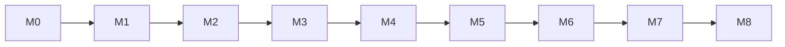

# Plan: MVP

**Status:** Freigegeben (Umsetzungsplan)  
**Datum:** 2026-08-09  
**Owner:** Projekt / Agent-Workflow  
**Bezug:** [`docs/KONZEPT.md`](../KONZEPT.md) §15 · Ablauf: [`docs/ENTWICKLUNGSABLAUF.md`](../ENTWICKLUNGSABLAUF.md)  
**Art:** Stil C — [`docs/STYLE-BIBLE-C.md`](../STYLE-BIBLE-C.md)

---

## Ziel

Erste spielbare Version: Open-World **Seuzach** (Comic-Rettung), Mechs **Bolt / Marina / Rush**, Basen-Hub, Zufallsmissionen inkl. Spezialsichten, Speichern, Münzen-Pfad zu 100, Solo + lokaler 2P/Helfer — Godot 4.

---

## Gesamtfortschritt

| Epic | Name | Status | Fortschritt |
|------|------|--------|-------------|
| M0 | Godot-Grundgerüst & Tests | Erledigt | 6/6 |
| M1 | Input, Spieler, Transform | Erledigt | 8/8 |
| M2 | Art-Spike Stil C | Erledigt | 7/7 |
| M3 | Seuzach Iso-Welt & Hub | In Arbeit | 4/8 |
| M4 | Energie, Kollision, Solar, Waffen | Nicht gestartet | 0/7 |
| M5 | Missionen & Spezialsichten | Nicht gestartet | 0/9 |
| M6 | Scan, Münzen, Save, Finale-Stub | Nicht gestartet | 0/8 |
| M7 | Lokaler Co-op & Helfer | Nicht gestartet | 0/6 |
| M8 | Polish, Balance, Release-Cut | Nicht gestartet | 0/6 |

**Legende Status:** `Nicht gestartet` · `In Arbeit` · `Review` · `Playtest` · `Erledigt`

> Fortschritt aktualisieren: Checkboxen unten abhaken und die Zähler in dieser Tabelle nachziehen.

---

## Scope

### In (MVP)

- Open-World-Karte Seuzach (stilisiert, Kacheln)
- Erdstation-Hub (Kirchgasse/Dorfkern)
- Bolt + Marina + **Rush** (roter Supercar, Chase/Tempo); Robot + je 1 Standardform + 2 Scans
- Zufallsmissionen: Alltag + mind. 1 ausgefallen (Strom **oder** Alien)
- 3 Sichten: Iso-Rettung, Feuer, Flug-Sidescroller
- Sonnenenergie, Kollisions-Stop, Energie-Schwert/-Axt (Ziel-Filter)
- Münzen, Speichern, Pfad zu 100 Münzen (Finale Stub/Cutscene ok)
- Solo + 2P lokal inkl. Helfer-Modus
- Team-Link vorbereitet (Hook/Stub ok, volle Kombi optional wenn Zeit)

### Nicht (MVP)

- Online, weitere Orte, alle Basis-Typen, Aero/Diggs spielbar, volles Raumschiff-Gameplay, PvP

---

## Systeme

Autoloads / Kern: `GameState`, `SaveService`, `InputGlyphs`, `MissionCatalog`  
Scenes: Boot → Hub → World Seuzach → Spezial (Feuer/Flug/Iso)  
Art: `comic-rettung-art` · Tests: GdUnit4 oder GUT · Review/Playtest: `code-reviewer` / `godot-playtester`

---

## Epics & Schritte

Pro Epic gilt der Ablauf: Plan (dieses File pflegen) → `feature-implementer` (+ Art) → `code-reviewer` → Findings fixen → `godot-playtester` → Commit/Push/Tag.

---

### M0 — Godot-Grundgerüst & Tests

**Ziel:** Leeres Godot-4-Projekt startet; Test-Runner läuft.  
**Subagenten:** `feature-implementer` → `code-reviewer` → `godot-playtester`

#### Schritte

- [x] Godot 4 Projekt anlegen (`project.godot`), Ordnerstruktur (`scenes/`, `scripts/`, `assets/`, `tests/`)
- [x] `.gitignore` für Godot
- [x] Boot-/Main-Scene (Platzhalter-UI „Transformierende Rettungsmechs“)
- [x] Autoload-Stubs: `GameState`, `SaveService`
- [x] Smoke-Tests: Interim-`SceneTree`-Runner (`tests/smoke_test.gd` / `scripts/run_tests.sh`); GdUnit4/GUT Follow-up später
- [x] Playtest: Editor/CLI startet ohne Parse-Error

#### Testplan M0

- [x] Automatisiert: Smoke-Test grün
- [x] Playtest: Haupt-Scene startet

#### Art-Bedarf M0

- [x] Keine neuen Assets (Placeholder ok)

#### Akzeptanz M0

- [x] Projekt im Repo, Tests laufen, Playtest Pass

---

### M1 — Input, Spieler, Transform

**Ziel:** Figur bewegen (Tastatur + Xbox), Robot ↔ Fahrzeug umschalten.  
**Subagenten:** `feature-implementer` (Placeholder-Sprites ok) → Review → Playtest  
*(Finale Art in M2 nachziehen)*

#### Schritte

- [x] Input-Map: move, interact, transform, gadget, scan, pause/save
- [x] `Player`-Scene mit Form-State: `robot` / `vehicle`
- [x] Bewegung Iso (kartesisch → iso-Projektion)
- [x] Transform-Toggle mit kurzem Lockout
- [x] Controller + Tastatur Binding (1 Device; Playtest manuell)
- [x] Glyph-Hilfe stub (`InputGlyphs`)
- [x] Unit-Tests: State-Wechsel, Input-Actions existieren
- [x] Playtest: Bewegen + Transform ohne Crash

#### Testplan M1

- [x] Automatisiert: Transform-State-Tests
- [x] Playtest: Headless-Start / Export-Smoke (Gamepad manuell später)

#### Art-Bedarf M1

- [x] Platzhalter-Polygone; finale Art → M2 / `comic-rettung-art`

#### Akzeptanz M1

- [x] Solo-Steuerung + Transform funktional

---

### M2 — Art-Spike Stil C

**Ziel:** Erste spielbare Comic-Rettung-Assets integriert.  
**Subagenten:** **`comic-rettung-art`** → `feature-implementer` (Integration) → Review → Playtest

#### Schritte

- [x] Art: Bolt Robot + Bolt Fahrzeug (an `c-mech` / `c-fahrzeug` angelehnt)
- [x] Art: Marina Robot + Marina Fahrzeug
- [x] Art: Transform-Frames Bolt (6 Frames) + Godot `SpriteFrames`
- [x] Art: Iso-Tiles Basis-Set (Gras, Straße, Haus, Kirche)
- [x] Art: Erdstation-/Hub-Visual
- [x] Integration in Player + Tile/Prop-Probe
- [x] Kurz-Check Style-Bible C (Outline, Palette via Art-Subagent)

#### Testplan M2

- [x] Automatisiert: Asset-Load + Player-Art (`m2_test`)
- [x] Playtest: Scene startet mit Art-Spike

#### Art-Bedarf M2

- [x] Neue Grafiken/Animationen → **`comic-rettung-art`** (Refs: `docs/design-refs/c-*.png`)

#### Akzeptanz M2

- [x] Stil-C-Spike im Spiel sichtbar

---

### M3 — Seuzach Iso-Welt & Hub

**Ziel:** Begeh-/befahrbare stilisierte Seuzach-Karte + Erdstation-Hub.  
**Subagenten:** Art (Landmarken nach Bedarf) + `feature-implementer` → Review → Playtest

#### Schritte

- [x] Referenz-Layout Seuzach skizzieren (Dorfkern, Bahnhof, Wohnen, Felder, Wald, Rand)
- [x] Iso-TileMap World-Scene bauen
- [ ] Collision auf Gebäuden/Hindernissen
- [x] Y-Sort / Zeichenreihenfolge
- [ ] Hub-Scene Erdstation: Ein-/Ausfahrt zur World
- [x] Kamera follow Spieler
- [ ] Tests: Scene-Wechsel Hub ↔ World; Spawn-Punkt
- [ ] Playtest: Karte erkundbar, Hub erreichbar

#### Testplan M3

- [ ] Automatisiert: Scene-Transition / Spawn
- [ ] Playtest: Landmarken erkennbar genug für MVP

#### Art-Bedarf M3

- [ ] Weitere Tiles/Props nach Bedarf → `comic-rettung-art`

#### Akzeptanz M3

- [ ] Open-World-Ausschnitt Seuzach + Hub spielbar

---

### M4 — Energie, Kollision, Solar, Waffen

**Ziel:** Kollisions-Stop + Energie; Solar-Aufladung; Energie-Waffe mit Ziel-Filter.  
**Subagenten:** `feature-implementer` (+ Art für Waffe/VFX optional) → Review → Playtest

#### Schritte

- [ ] Energie-Komponente am Spieler
- [ ] Bei Wand-/Umwelt-Hit: Schaden + **sofort Stop** (kein Weiterrutschen)
- [ ] Solar-Aufladung in Robot-Form im Freien (VFX-Ring)
- [ ] Nacht/Schatten: langsameres Laden (einfache Regel)
- [ ] Energie-Schwert oder -Axt: nur Layers Mechs/Gebäude/Hindernisse
- [ ] Tests: Kollisions-Stop, Filter trifft keine „Person“-Layer, Solar tick
- [ ] Playtest: Kindgerechtes Feedback (Funken, kein Gore)

#### Testplan M4

- [ ] Automatisiert: Energie/Collision/Filter
- [ ] Playtest: Stop-Verhalten spürbar

#### Art-Bedarf M4

- [ ] Optional: Waffe + Solar-VFX → `comic-rettung-art`

#### Akzeptanz M4

- [ ] Regeln aus Konzept spürbar und getestet

---

### M5 — Missionen & Spezialsichten

**Ziel:** Zufallsnotfälle + drei Missionstypen.  
**Subagenten:** `feature-implementer` + Art für Mission-Props → Review → Playtest

#### Schritte

- [ ] `MissionCatalog` + Spawner (Alltag + 1× Strom **oder** Alien)
- [ ] Rettungs-Radio Bubble (Text/Icon stub)
- [ ] Iso-Rettungsmission (in World oder Sub-Scene)
- [ ] Feuer-Minispiel-Scene (Top-down/nah)
- [ ] Flug-Sidescroller-Scene (L→R)
- [ ] Belohnung: Münzen + Rückkehr World
- [ ] Fail-soft Retry ohne harte Strafe
- [ ] Tests: Spawner wählt Typen; Mission Complete Payload
- [ ] Playtest: alle 3 Sichten einmal durchspielbar

#### Testplan M5

- [ ] Automatisiert: Catalog/Spawner/Rewards
- [ ] Playtest: Feuer + Flug + Iso

#### Art-Bedarf M5

- [ ] Mission-Props, Feuer/Flug-Hintergründe → `comic-rettung-art`

#### Akzeptanz M5

- [ ] Zufallsmissionen + 3 Sichten MVP-fertig

---

### M6 — Scan, Münzen, Save, Finale-Stub

**Ziel:** Scan-System, Münz-HUD, Speichern, 100-Münzen-Ziel sichtbar.  
**Subagenten:** `feature-implementer` (+ Art Scan-FX/HUD) → Review → Playtest

#### Schritte

- [ ] Scan-Interaktion an markierten Fahrzeugen; Unlock Form (Limit 2 Scans/Mech im MVP = „+2“)
- [ ] `GameState.coins`; HUD immer sichtbar
- [ ] Mission/Fundstücke erhöhen Münzen
- [ ] `SaveService`: manuell + Auto-Save (Hub, Mission-Ende)
- [ ] Load-Slot / Weiterspielen vom Boot
- [ ] Bei ≥100 Münzen: Finale-Stub (Cutscene/Text „Raumschiff / Heimflug“)
- [ ] Tests: Save/Load Roundtrip; Coin-Gain; Scan-Unlock
- [ ] Playtest: Speichern → Quit → Laden; Münz-Ziel verständlich

#### Testplan M6

- [ ] Automatisiert: Save/Load, Coins, Scan
- [ ] Playtest: Persistenz

#### Art-Bedarf M6

- [ ] Münz-Icon, Scan-Kreis, Stub-Finale-Bild → `comic-rettung-art`

#### Akzeptanz M6

- [ ] Meta-Loop MVP geschlossen

---

### M7 — Lokaler Co-op & Helfer

**Ziel:** Drop-in Spieler 2; Helfer-Modus.  
**Subagenten:** `feature-implementer` → Review → Playtest

#### Schritte

- [ ] Device-Zuordnung Spieler 1/2 (Keyboard/Gamepad)
- [ ] Zweiter Avatar oder Helfer-Pawn
- [ ] Helfer-Gadgets: Hinweis-Pfeil, Schild-Blase, Solar-Boost (mind. 2 davon)
- [ ] Geteilte Münzen; getrennte Energie
- [ ] Tests: 2 Input-Devices mappen; Helfer kann Mission nicht allein „gewinnen“ (Regel)
- [ ] Playtest: 2P Drop-in / Drop-out

#### Testplan M7

- [ ] Automatisiert: Device-Join / Modus-Flag
- [ ] Playtest: Couch-Co-op Smoke

#### Art-Bedarf M7

- [ ] Outline-Farben P1/P2; Helfer-Icons → ggf. `comic-rettung-art`

#### Akzeptanz M7

- [ ] Solo + lokaler 2P/Helfer laut Konzept

---

### M8 — Polish, Balance, Release-Cut

**Ziel:** MVP „zeigbar“; Version taggen.  
**Subagenten:** Review → Playtest → Git-Release

#### Schritte

- [ ] Münz-Balance grob (Missionen bis ~100 spielbar in zumutbarer Zeit)
- [ ] Pause-Menü: Speichern, Zurück, Steuerung-Hilfe
- [ ] Bekannte Crashes fixen; Log clean on boot
- [ ] README: wie starten / Tests / Godot-Version
- [ ] Gesamter Durchlauf: Hub → World → 3 Missionstypen → Save → Finale-Stub
- [ ] Release: Commit, Push, Tag (z. B. `v0.9.0-mvp` oder `v1.0.0-mvp` nach Absprache)

#### Testplan M8

- [ ] Automatisiert: volle Suite grün
- [ ] Playtest: End-to-End Pass (`godot-playtester` + manuell)

#### Art-Bedarf M8

- [ ] Nur Lücken schließen → `comic-rettung-art`

#### Akzeptanz M8

- [ ] MVP-Akzeptanzkriterien unten alle erfüllt

---

## Art-Bedarf (gesamt)

- [x] Neue Grafiken/Animationen über MVP hinweg → Subagent **`comic-rettung-art`**
- Details: Spike M2, World/Hub M3, Missionen M5, HUD/Scan/Finale M6, Co-op-Markers M7

---

## Testplan (gesamt)

### Automatisiert

- [ ] Suite pro Epic grün bevor Weiter
- [ ] Save/Load, Transform, Mission-Reward, Input-Actions abgedeckt

### Playtest / Smoke

- [ ] Haupt-Scene startet ohne Error
- [ ] Seuzach erkunden, Hub, Transform, Solar, Waffe-Filter
- [ ] Drei Spezialsichten
- [ ] Speichern/Laden
- [ ] 2P/Helfer
- [ ] Finale-Stub bei 100 Münzen (ggf. Debug-Cheat für QA)

---

## Akzeptanzkriterien (MVP gesamt)

- [ ] Seuzach-Open-World + Erdstation spielbar (Stil C)
- [ ] Bolt, Marina & Rush mit Robot + Standardform + Scans
- [ ] Zufallsmissionen inkl. Alltag + 1 ausgefallen
- [ ] Iso-, Feuer- und Flug-Mission spielbar
- [ ] Kollisions-Stop, Solar, Energie-Waffe mit Filter
- [ ] Münzen + Speichern + sichtbares 100-Münzen-Ziel inkl. Stub-Finale
- [ ] Solo + lokaler 2P inkl. Helfer-Modus
- [ ] Automatisierte Tests grün
- [ ] Code Review ohne offene Critical/High (pro Epic)
- [ ] Playtest Pass End-to-End

---

## Reihenfolge (empfohlen)

Abhängigkeiten: M2 kann parallel zu späten M1-Fixes starten; M7 nach stabilem M1/M5; M8 zuletzt.

---

## Änderungslog dieses Plans

| Datum | Änderung |
|-------|----------|
| 2026-08-09 | Initialer MVP-Umsetzungsplan mit Epics M0–M8 und Fortschritts-Tracking |
| 2026-08-09 | Verweis: bei Bugs gilt Phase 0 (Repro + RCA) laut ENTWICKLUNGSABLAUF |
| 2026-08-09 | M0 erledigt: Godot 4.4 Projekt, Autoloads, Smoke-Tests, Playtest Pass |
| 2026-08-09 | M1 erledigt: Input, Player, Iso-Bewegung, Transform, Tests |
| 2026-08-09 | M2 erledigt: Style-C-Art, Player-Sprites, Transform-Anim, Welt-Probe |
| 2026-08-09 | Mech-Formen an Hauptfahrzeug angeglichen (Bolt/Marina) |
| 2026-08-09 | Rush (roter Supercar) ergänzt — Konzept + Art + Sandbox |
